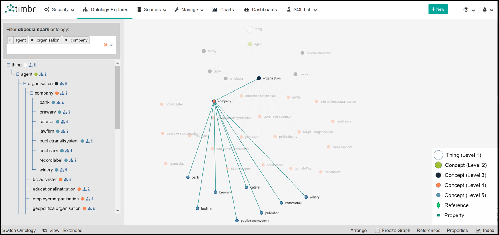
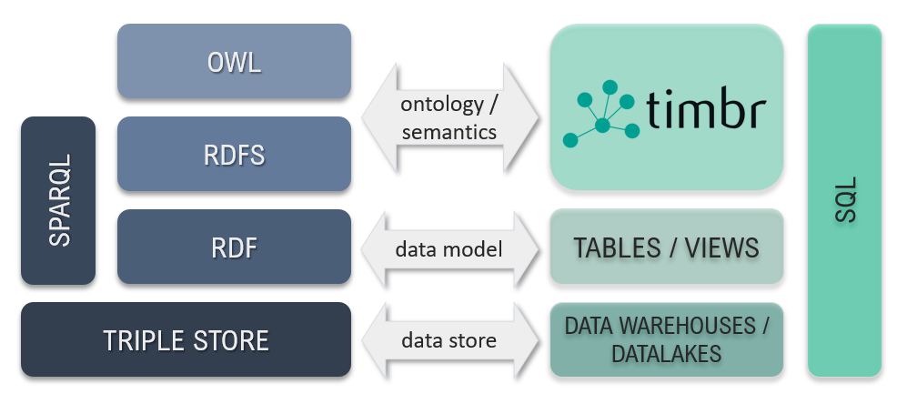
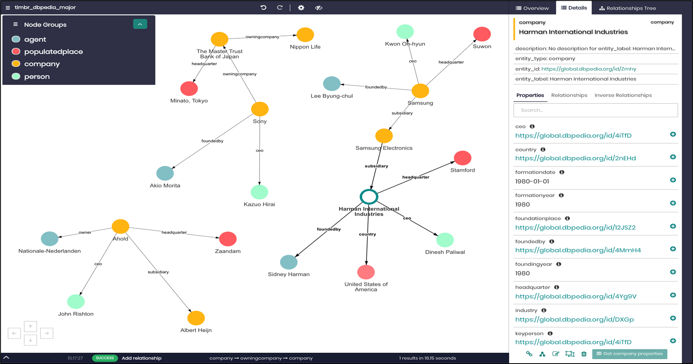
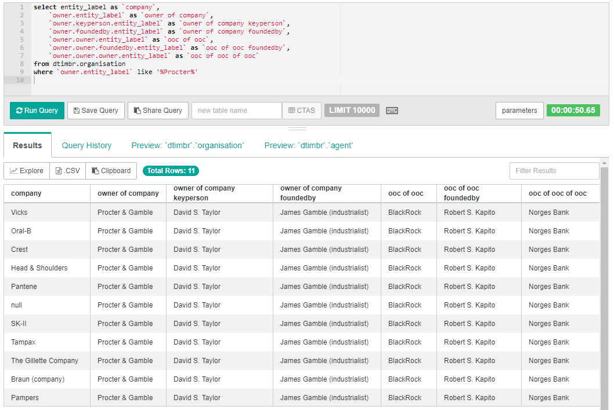
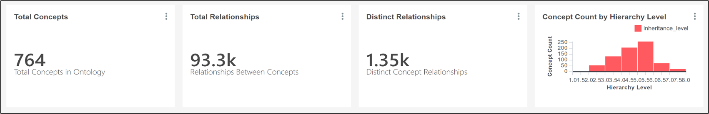
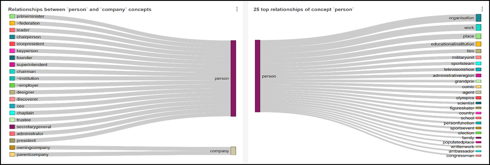

# DBpedia in SQL with Timbr

### DESCRIPTION
DBpedia is a crowd-sourced community effort to extract structured content from the information created in various Wikimedia projects. This structured information resembles an open knowledge graph (OKG) which is available for everyone on the Web.

When connecting DBpedia to the Timbr platform, users can then:
* Query DBpedia in SQL as a Knowledge Graph
* Explore DBpedia's ontology
* Integrate DBpedia with existing data-sources

### The Timbr-DBpedia Ontology
Timbr’s Ontology Modeler provides a visual interface to easily model concepts, properties, and relationships.

### The Timbr-DBpedia Semantic Web Stack
Timbr-DBpedia supports RDFS/OWL ontologies via its virtual SQL compiler which fulfills the Semantic Web stack.

### Exploring DBpedia with Timbr's Graph Explorer
Timbr’s Graph Data Explorer allows users to visualize the underlying data as a graph, to explore and discover relationships and dependencies in the data. The module enables traversing the entire organizational data so users can better understand the data, discover hidden value, visually find answers and expose the data without need of extracting tables or views before running a query.

### Querying DBpedia with Timbr's Semantic SQL
Timbr's SQL Editor handles the process of creating, editing and running the semantically enabled SQL queries that require up to 90% less code than SQL queries without a knowledge graph.

### DBpedia inisghts using Timbr's built in BI module

|:--:| 
| *A summary of the DBpedia ontology by inheritance and relationships* |

|:--:| 
| *Insights into the concept person relationships* |

## Additional Resources & Contact Info

* [DBpedia + SQL = timbr-DBpedia](https://medium.com/@cenguix/dbpedia-sql-timbr-dbpedia-open-knowledge-graph-bfe1b59c2a2b)
* [Wikipedia’s Knowledge Graph (DBpedia) in SQL](https://the-barcohen.medium.com/how-we-query-wikipedias-knowledge-graph-dbpedia-in-sql-using-timbr-292a47b86772)
* [Timbr FAQs](https://timbr.ai/timbr-faqs/)  
* [Timbr Contact](https://timbr.ai/contact/)
