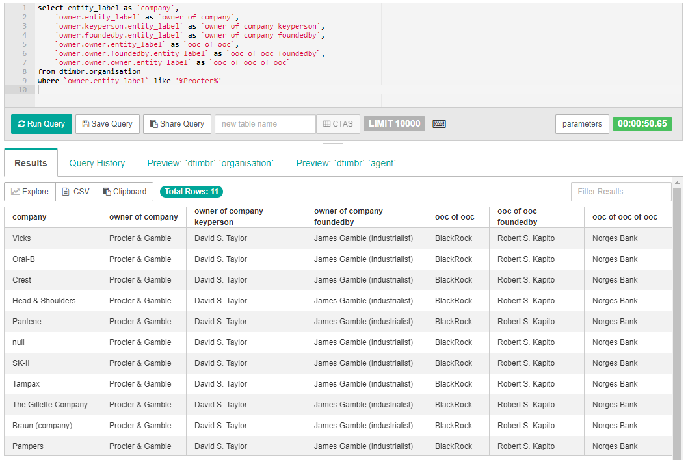

# Timbr-DBpedia SQL Scripts
Scripts in this folder are used for **querying** the Timbr-DBpedia knowledge graph.

## Scripts

| Script              | Description |
| ------------------- | ----------- |
| [general_query_1.sql](./general_query_1.sql) | First general query that finds the type and amount of people that exist in the DBpedia Ontology. |
| [general_query_2.sql](./general_query_2.sql) | Second general query that finds all the things (any concept with a date) that happened on the 1st of Jan. 2000. |
| [general_query_3.sql](./general_query_3.sql) | Third general query that finds all the CEO's of US companies that were born outside of the USA. |
| [business_query_1.sql](./business_query_1.sql) | First business query that finds the entities that are owners of banks in Europe. |
| [business_query_2.sql](./business_query_2.sql) | Second business query that finds the companies in Europe or Asia that have the highest operating income per employee. |
| [business_query_3.sql](./business_query_3.sql) | Third business query that finds all the companies that their parent company is owned by an organisation containing the word 'Warner'. |
| [marketing_query_1.sql](./marketing_query_1.sql) | First marketing query that finds the things that have a slogan containing the word 'Best'. |
| [marketing_query_2.sql](./marketing_query_2.sql) | Second marketing query that finds the types of works that contain the word 'Batman' (including the release date, ISBN, or IMDB-ID if available). |
| [marketing_query_3.sql](./marketing_query_3.sql) | Third marketing query that finds the most common words (more than 4 letters) used in company mottos. |
| [healthcare_and_research_query_1.sql](./healthcare_and_research_query_1.sql) | First healthcare and research query that finds the amount of hospitals by country. |
| [healthcare_and_research_query_2.sql](./healthcare_and_research_query_2.sql) | Second healthcare and research query that finds diseases that result from complications that are related to heart issues. |
| [healthcare_and_research_query_3.sql](./healthcare_and_research_query_3.sql) | Third healthcare and research query that finds good solvents for chemical compounds that have a melting point > 200 and a solubility < 1000. |
| [education_query_1.sql](./education_query_1.sql) | First education query that finds the universities that have the highest number of faculty members. |
| [education_query_2.sql](./education_query_2.sql) | Second education query that finds the 100 oldest battles of the United Kingdom. |
| [education_query_3.sql](./education_query_3.sql) | Third education query that finds which academic journals have the highest impact factor. |
| [entertainment_query_1.sql](./entertainment_query_1.sql) | First entertainment query that finds the artists with the most popular songs. |
| [entertainment_query_2.sql](./entertainment_query_2.sql) | Second entertainment query that finds all the soccer managers who were also soccer players. |
| [entertainment_query_3.sql](./entertainment_query_3.sql) | Third entertainment query that finds who directed most of Adam Sandler's films. |
